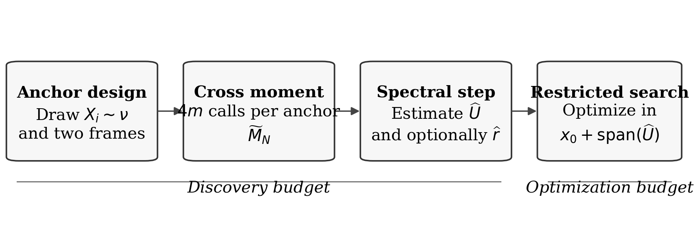
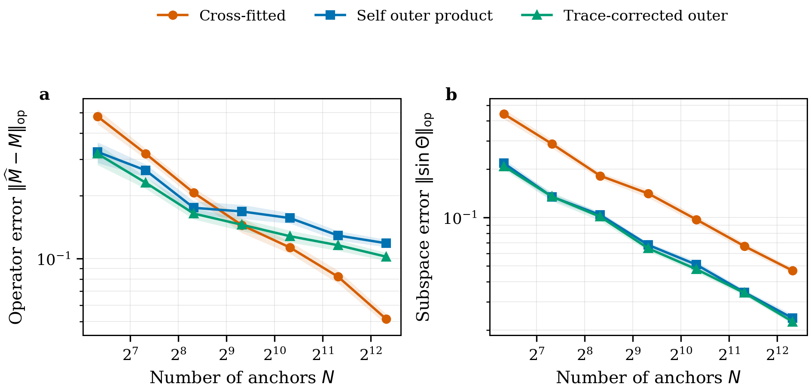
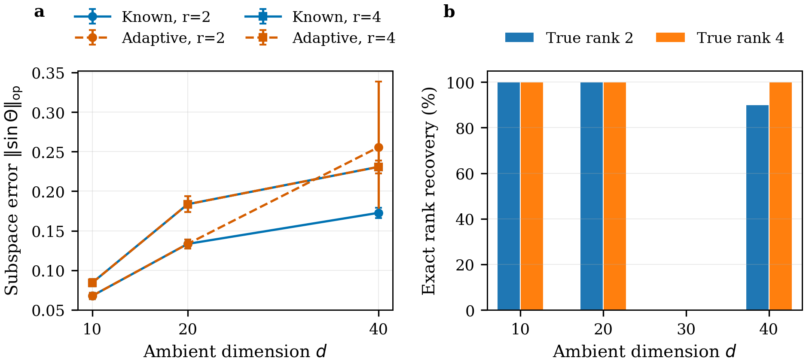
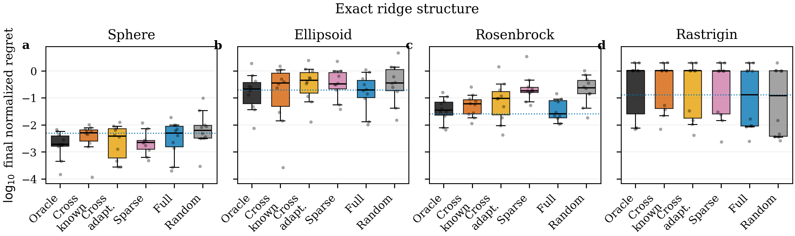
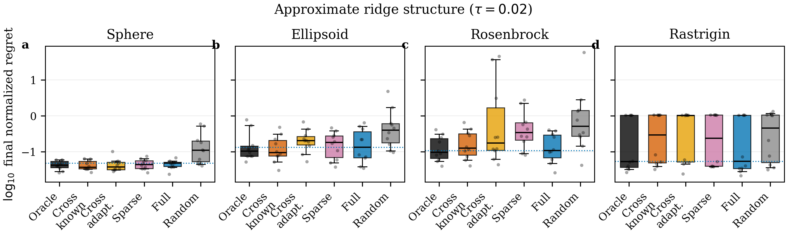
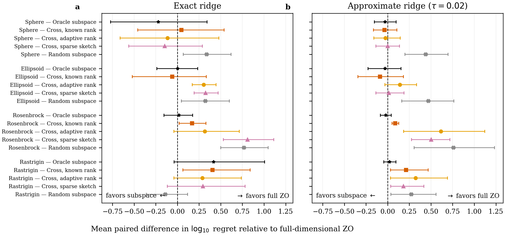
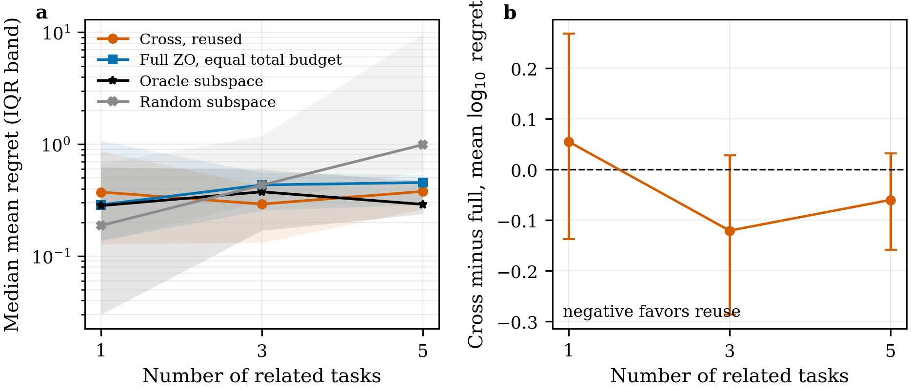

# Introduction {#sec-introduction}

A black-box optimizer receives function values but no gradients. Its basic statistical difficulty is dimensional: a random directional derivative in an ambient space of dimension $d$ spreads information across $d$ coordinates, and the variance of a standard two-point gradient estimate typically grows with dimension [@nesterov2017random; @duchi2015optimal; @shamir2017optimal]. Yet many scientific and operational simulators have much lower *effective* dimension. Their outputs change strongly only along a few combinations of parameters, even though the input vector itself is long; aerodynamic shape studies provide one representative application [@hall2021active]. Active-subspace analysis formalizes this observation through the leading eigenspace of the gradient second-moment matrix [@constantine2015active], and randomized gradient sketches can reduce the cost when derivatives are available [@constantine2015sketching]. Random embedding and trajectory-informed methods use related ideas to reduce black-box search [@nayebi2019hesbo; @golovin2020gradientless; @nozawa2024zeroth].

A central cost is often hidden in this literature. Before an optimizer can work in an $r$-dimensional subspace, it must discover that subspace from observations. When gradients are available, one may estimate the active-subspace matrix from gradient outer products. Under a function-value oracle, however, each gradient is itself a noisy random-direction estimate. Squaring that estimate creates a fourth-moment distortion. The distortion does not necessarily rotate population eigenvectors, but it changes the target spectrum, creates a nonzero spectral tail, complicates rank selection, and prevents the matrix estimate from being calibrated in operator norm.

This article treats structure discovery as a first-class statistical problem. At each anchor point, we create two independent gradient sketches and cross-fit them: the first sketch is multiplied by the second rather than by itself. Conditional independence makes the resulting cross-moment target the outer product of the *mean* sketch. Orthogonal direction batches reduce within-anchor variance without changing the query ledger. The result is then used to estimate the active subspace, select its dimension, and restrict a two-point optimizer.

The contribution is deliberately narrower than a claim that subspace optimization always dominates full-dimensional optimization. We establish the following.

1. **A calibrated cross-fitted moment estimator.** For the ball-smoothed objective, the raw symmetrized cross moment is conditionally unbiased for the gradient outer product. For quadratic ridge functions, centered finite differences remove smoothing bias exactly.
2. **A transparent comparison with self outer products.** For a one-direction noiseless sketch, the expectation of the conventional outer product is derived exactly. It contains both multiplicative and isotropic inflation. This explains why the ordinary estimator may have good finite-sample eigenvectors while remaining poorly calibrated as a matrix estimator.
3. **Finite-sample structure recovery.** A matrix Bernstein argument gives operator-norm concentration under bounded or clipped sketches; Davis--Kahan perturbation converts this into a principal-angle guarantee, and an eigengap selector is correct when the estimation error is below a signal-dependent threshold.
4. **An optimization transfer principle.** The final error separates into optimization error inside the estimated subspace and an approximation floor proportional to the squared principal-angle error. A stochastic two-point corollary makes the intrinsic dimension explicit.
5. **A discovery lower bound.** Under a Gaussian function-value oracle, estimating an unknown rank-one direction to angle $\varepsilon$ requires order $d/\varepsilon^2$ observations up to signal-to-noise factors. Ambient dimension can therefore be shifted into a one-time discovery phase, but cannot generally be eliminated.
6. **A complete reproducible artifact.** The repository includes source code, tests, fixed experiment configurations, raw outputs, summaries, paired bootstrap analyses, figures, environment files, and a Quarto manuscript. The default benchmark functions use public canonical BBOB formulas; an optional adapter connects to the official COCO suite [@hansen2016coco].

The empirical results are intentionally diagnostic. Cross-fitting eventually improves operator calibration, but the self outer product has lower finite-sample subspace error in the tested quadratic setting. In optimization, an accurately estimated subspace helps smooth ridge objectives and can be amortized over related tasks. It may offer no advantage on one isolated task after charging the discovery budget, and subspace restriction can be actively harmful on multimodal functions. These negative results define the method's domain of usefulness.

# Relation to existing approaches {#sec-related}

## Active subspaces with and without gradients

The classical active-subspace matrix is a population covariance of gradients [@constantine2015active]. When exact or adjoint gradients are available, it can be estimated directly, and randomized linear measurements can lower the cost of collecting those gradients [@constantine2015sketching]. The present problem is statistically different: only scalar function values are observed, so every gradient-like vector is itself a random finite-difference estimate. The target matrix is therefore not observed with ordinary additive noise. A self outer product squares both the signal and the directional-estimation error, producing a structured population distortion before finite-sample concentration is considered.

This distinction also separates the article from application-specific active-subspace studies, where the gradient matrix is often treated as an input to dimension reduction. Here, estimating that matrix is the primary inferential task. Matrix calibration matters because the spectral tail is used to diagnose approximate ridge structure and to select a dimension. An estimator that preserves eigenvectors while shifting the spectrum can be adequate for a known-rank projection but misleading for rank adaptation.

## Embedded and random-subspace optimization

Random embeddings reduce a high-dimensional search to a lower-dimensional auxiliary problem without first identifying a population active subspace [@nayebi2019hesbo]. Random-subspace zeroth-order methods similarly restrict individual updates or local searches to sampled low-dimensional spaces [@nozawa2024zeroth]. These methods can be effective even when no fixed subspace is learned. Their principal advantage is that they avoid a separate discovery stage; their limitation for the present purpose is that they do not estimate a reusable, interpretable structural object.

The learned-subspace setting has a different cost profile. It pays an ambient-dimensional acquisition cost once and can then reuse the estimated projector over many iterations or related tasks. This creates the central question studied here: when is the statistical accuracy of a learned subspace sufficient to offset its query cost? The answer depends jointly on eigengap, finite-difference noise, downstream curvature, optimization horizon, and the number of tasks over which discovery is amortized.

## Zeroth-order oracle complexity

Two-point zeroth-order methods attain sharp rates for several convex oracle models, but their gradient-estimator variance and oracle complexity retain an explicit dimension dependence [@duchi2015optimal; @nesterov2017random; @shamir2017optimal]. Trajectory-informed methods and high-dimensional gradientless procedures exploit additional structure to reduce empirical cost [@golovin2020gradientless]. Our analysis is complementary: it isolates one source of reusable structure, quantifies the error of learning it, and then propagates that error into a restricted optimization problem.

The contribution is not a new universally superior black-box optimizer. To avoid conflating representation learning with optimizer design, the experiments use the same two-point update family across oracle, learned, random, and full-dimensional spaces. General-purpose global optimizers such as CMA-ES are outside the comparison because a victory or loss against a different search mechanism would not identify whether the active-subspace estimator itself was responsible. The public COCO adapter is included for a future optimizer-level benchmark, but the claims in this article remain estimator- and mechanism-focused.

## Cross-fitting as a noise-decoupling device

Cross-fitting is used here in a literal moment-estimation sense: two conditionally independent sketches are multiplied so that their independent zero-mean errors do not contribute a self-covariance term. No sample-splitting claim about nuisance-function estimation is needed. The relevant ingredients are conditional independence, a common conditional mean, and a symmetrized product. This simple construction gives an exactly interpretable population target, but not automatically the smallest finite-sample variance. The theoretical and empirical comparison with self products therefore emphasizes estimands and risk criteria rather than labeling one estimator uniformly best.

# Problem formulation {#sec-problem}

## Function-value oracle

Let $\mathcal X\subseteq \mathbb R^d$ be a compact convex set. The algorithm queries

$$
Y(x)=f(x)+\xi,
$$

where $\mathbb E[\xi\mid x]=0$. Independent calls have independent noise unless stated otherwise. The primary structural object is the gradient second moment under an anchor distribution $\nu$:

$$
M=\mathbb E_{X\sim\nu}
\left[\nabla f(X)\nabla f(X)^\top\right].
$$

The leading $r$-dimensional eigenspace of $M$ is denoted $U_\star\in\mathbb R^{d\times r}$. Write the ordered eigenvalues as

$$
\lambda_1\geq\cdots\geq\lambda_r
>\lambda_{r+1}\geq\cdots\geq0,
\qquad
\Delta_r=\lambda_r-\lambda_{r+1}.
$$

An exact ridge objective has the form

$$
f(x)=\phi(U_\star^\top(x-s)),
$$

where $s$ is a shift. We also consider an approximate ridge model,

$$
f_\tau(x)=\phi(U_\star^\top(x-s))
+\frac{\tau}{2}\Vert(I-U_\star U_\star^\top)(x-s)\Vert_2^2,
$$

with $\tau\geq0$. This construction gives a controlled departure from exact low-dimensional structure while retaining a known reference subspace.

## Assumptions and scope

The analysis deliberately separates assumptions needed for different conclusions. @prp-unbiased requires only differentiability sufficient for ball smoothing, conditionally independent direction frames, and independent mean-zero noise across the two sketches. The concentration result adds boundedness, which can be enforced by clipping at the cost of a clipping-bias term. The eigenspace and rank statements require a non-negligible spectral gap. The optimization-transfer theorem is convex and local to a feasible affine representative. Finally, the lower bound uses a Gaussian oracle only to obtain a transparent Kullback--Leibler calculation.

These assumptions are not silently transferred to the entire experimental suite. The numerical optimization study includes nonconvex Rosenbrock and multimodal Rastrigin objectives, for which @thm-transfer is not a global convergence theorem. Gaussian observation noise is unbounded, whereas @thm-concentration is stated for bounded or clipped sketches. Those experiments are stress tests of the implemented procedure, not empirical proofs of the theorem outside its hypotheses. This separation between proved scope and computational scope is maintained throughout the article.

## What must be estimated

There are three distinct targets.

- **Matrix calibration:** estimate $M$ in operator norm. This matters for spectrum interpretation and downstream uncertainty bounds.
- **Subspace recovery:** estimate the projector $P_\star=U_\star U_\star^\top$. The loss is
  $$
  \mathcal L_{\mathrm{sub}}(\widehat U,U_\star)
  =\Vert\sin\Theta(\widehat U,U_\star)\Vert_{\mathrm{op}}.
  $$
- **Optimization:** minimize $f$ with a total query budget that includes both discovery and optimization.

These targets need not rank estimators identically. An estimator can preserve the leading eigenspace while being a biased estimate of $M$. Conversely, a calibrated estimator may have higher finite-sample eigenvector variance. The experiments separate these criteria.

# Cross-fitted orthogonal sketches {#sec-method}

## Centered directional differences

For a unit direction $u$, smoothing radius $h>0$, and anchor $x$, define

$$
\delta_hY(x;u)=\frac{Y(x+hu)-Y(x-hu)}{2h}.
$$

For a matrix $Q=[q_1,\ldots,q_m]\in\mathbb R^{d\times m}$ with orthonormal columns, define the batched sketch

$$
\widehat g_Q(x)
=\frac{d}{m}\sum_{j=1}^m\delta_hY(x;q_j)q_j.
$$

The factor $d/m$ corrects the mean projector because a uniformly random $m$-frame satisfies

$$
\mathbb E[QQ^\top]=\frac{m}{d}I_d.
$$

Orthogonal directions provide a variance-reduced alternative to $m$ independent directions. They also avoid spending several nearly collinear probes at the same anchor.

The implementation is short and exposes the exact query count.

```{python}
#| eval: false
from discoverzo.subspace import CrossMomentEstimator

estimator = CrossMomentEstimator(
    h=0.03,
    anchor_radius=1.0,
    directions_per_side=12,
    psd_projection=True,
)
result = estimator.estimate(oracle, d=12, n_anchors=15, rng=rng)
print(result.query_count)  # 4 * 12 * 15 = 720
```

## Cross fitting

At anchor $X_i$, draw two independent orthogonal frames $Q_i$ and $R_i$ and form

$$
\widehat g_i^{(1)}=\widehat g_{Q_i}(X_i),
\qquad
\widehat g_i^{(2)}=\widehat g_{R_i}(X_i).
$$

The raw cross-fitted estimator is

$$
\widetilde M_N
=\frac{1}{2N}\sum_{i=1}^N
\left(
\widehat g_i^{(1)}\widehat g_i^{(2)\top}
+\widehat g_i^{(2)}\widehat g_i^{(1)\top}
\right).
$$

Because a finite-sample cross moment need not be positive semidefinite, the software optionally reports

$$
\widehat M_N=\Pi_{\mathbb S_+^d}(\widetilde M_N),
$$

where negative eigenvalues are truncated. All unbiasedness statements below concern the raw estimator $\widetilde M_N$. The PSD projection is a numerical post-processing step; it is nonexpansive in Frobenius norm toward a PSD target but is not asserted to preserve operator-norm unbiasedness.

## Mean sketch and smoothing target

Let $B_d=\{z\in\mathbb R^d:\Vert z\Vert\leq1\}$ and let $f_h$ denote uniform-ball smoothing,

$$
f_h(x)=\mathbb E_{V\sim\mathrm{Unif}(B_d)}[f(x+hV)].
$$

The standard spherical identity gives

$$
\nabla f_h(x)
=d\,\mathbb E_{U\sim\mathrm{Unif}(\mathbb S^{d-1})}
\left[\delta_h f(x;U)U\right].
$$

The same identity holds for a random orthogonal batch after averaging its columns.

::: {#prp-unbiased}
## Conditional cross-moment calibration

Assume independent, mean-zero oracle noise across all calls and independent frames $Q,R$ conditional on $X=x$. Then

$$
\mathbb E[\widehat g_Q(x)\mid X=x]
=\nabla f_h(x),
$$

and

$$
\mathbb E\left[
\frac{\widehat g_Q(x)\widehat g_R(x)^\top
+\widehat g_R(x)\widehat g_Q(x)^\top}{2}
\middle| X=x
\right]
=\nabla f_h(x)\nabla f_h(x)^\top.
$$

Consequently,

$$
\mathbb E[\widetilde M_N]=M_h
:=\mathbb E_{X\sim\nu}
[\nabla f_h(X)\nabla f_h(X)^\top].
$$
:::

For a quadratic function, the centered difference equals the exact directional derivative. Thus $M_h=M$ for every $h$ and Proposition 1 has no smoothing bias. For a three-times differentiable objective with bounded third derivative, $\Vert\nabla f_h-\nabla f\Vert=O(h^2)$ and $\Vert M_h-M\Vert_{\mathrm{op}}=O(h^2)$ under bounded gradients.

## Why not square one sketch?

The conventional estimator uses

$$
\widehat M_N^{\mathrm{out}}
=\frac1N\sum_{i=1}^N\widehat g_i\widehat g_i^\top.
$$

For one noiseless random direction and an exact directional derivative, its population target is available in closed form.

::: {#prp-inflation}
## Exact inflation for an orthogonal batch

Fix $g\in\mathbb R^d$. Let $Q\in\mathbb R^{d\times m}$, $1\leq m\leq d$, be Haar distributed on the Stiefel manifold, set $P=QQ^\top$, and define the noiseless orthogonal-batch sketch $\widehat g_Q=(d/m)Pg$. Then

$$
\mathbb E[\widehat g_Q\widehat g_Q^\top]
=\alpha_{d,m}gg^\top
+\beta_{d,m}\Vert g\Vert_2^2I_d,
$$ {#eq-outer-inflation}

where

$$
\alpha_{d,m}
=\frac{d\{d(m+1)-2\}}{m(d+2)(d-1)},
\qquad
\beta_{d,m}
=\frac{d(d-m)}{m(d+2)(d-1)}.
$$

For $m=1$, @eq-outer-inflation reduces to

$$
\mathbb E[\widehat g_Q\widehat g_Q^\top]
=\frac{d}{d+2}
\left(2gg^\top+\Vert g\Vert_2^2I_d\right),
$$

whereas for $m=d$ the sketch is exact and $\alpha_{d,d}=1$, $\beta_{d,d}=0$.
:::

The formula matches the orthogonal batches used in the implementation rather than analyzing only the one-direction special case. For $m<d$, the isotropic term leaves the population eigenvectors unchanged but fills the spectral tail and changes every eigenvalue. Independent additive oracle noise produces further self-product inflation. Cross-fitting removes both effects at the level of the raw population moment because the two sketches have conditionally independent zero-mean errors. The comparison is nevertheless a bias--variance trade-off: the self outer product is positive semidefinite before averaging and can yield lower finite-sample principal-angle error even while converging to the wrong matrix. The trace-adjusted estimator included in the artifact is explicitly treated as a heuristic diagnostic, not as an unbiased estimator.

# Finite-sample theory {#sec-theory}

## Matrix concentration

The raw terms may be heavy-tailed because finite differences divide noise by $h$. The implementation therefore supports spectral clipping. The next result is stated for naturally bounded sketches. When clipping is used, the same concentration argument applies around the clipped population moment, and the distance to $M_h$ must additionally include the clipping bias. We do not suppress that bias inside the theorem.

::: {#thm-concentration}
## Operator-norm concentration

Let

$$
Z_i=\frac12
\left(\widehat g_i^{(1)}\widehat g_i^{(2)\top}
+\widehat g_i^{(2)}\widehat g_i^{(1)\top}\right),
$$

and suppose $\Vert\widehat g_i^{(1)}\Vert_2,\Vert\widehat g_i^{(2)}\Vert_2\leq G$ almost surely. For independent anchors and sketches, with probability at least $1-\delta$,

$$
\Vert\widetilde M_N-M_h\Vert_{\mathrm{op}}
\leq
C G^2\left[
\sqrt{\frac{\log(2d/\delta)}{N}}
+\frac{\log(2d/\delta)}{N}
\right],
$$

where $C>0$ is a universal constant.
:::

This is a conservative, distribution-free statement. Tighter effective-rank bounds can replace $\log d$ under covariance assumptions [@koltchinskii2017concentration]. The theorem's purpose here is to expose the dependence relevant to discovery: the matrix error must be smaller than the active-subspace eigengap.

## Eigenspace recovery

::: {#cor-subspace}
## Principal-angle bound

Let $U_{h,r}$ contain the first $r$ eigenvectors of $M_h$, and let $\widehat U_r$ contain the first $r$ eigenvectors of $\widetilde M_N$. If

$$
\Vert\widetilde M_N-M_h\Vert_{\mathrm{op}}\leq\Delta_{h,r}/2,
$$

then

$$
\Vert\sin\Theta(\widehat U_r,U_{h,r})\Vert_{\mathrm{op}}
\leq
\frac{2\Vert\widetilde M_N-M_h\Vert_{\mathrm{op}}}{\Delta_{h,r}}.
$$
:::

The result follows from the Davis--Kahan sin-$\Theta$ theorem [@davis1970rotation]. Relative to the unsmoothed target $U_\star$, one additionally pays a smoothing perturbation term controlled by $\Vert M_h-M\Vert_{\mathrm{op}}/\Delta_r$.

## Rank selection

The software uses a scale-normalized eigengap rule because the operator-error radius is unknown in practice. Negative eigenvalues are truncated before selection, candidate gaps are divided by the larger of the following eigenvalue and a small fraction of the leading eigenvalue, and only eigenvalues above a relative floor are considered. The following proposition gives a rigorous benchmark for a threshold rule; it should not be read as a theorem for every data-driven eigengap heuristic.

::: {#prp-rank}
## Exact recovery by spectral thresholding

Suppose $M_h$ is positive semidefinite with rank $r$ and $\lambda_r(M_h)>0$. On an event where

$$
\Vert\widetilde M_N-M_h\Vert_{\mathrm{op}}\leq\varepsilon_N,
$$

choose a threshold $t_N$ satisfying

$$
\varepsilon_N<t_N<\lambda_r(M_h)-\varepsilon_N.
$$

Then

$$
\widehat r(t_N)
:=\#\{j:\lambda_j(\widetilde M_N)>t_N\}
=r.
$$

In particular, such a threshold exists whenever $2\varepsilon_N<\lambda_r(M_h)$.
:::

The proposition is intentionally a sufficient condition for a calibrated threshold, not a universal guarantee for an arbitrary spectrum or the implemented normalized eigengap rule. In applications, $\varepsilon_N$ and $\lambda_r(M_h)$ are unknown, which motivates the empirical selector. If several eigenvalues decay gradually, there may be no statistically identifiable single rank; an oracle inequality over candidate dimensions is then more appropriate than exact recovery.

# From discovery to optimization {#sec-optimization}

## Error decomposition

Let $A\in\mathbb R^{d\times q}$ have orthonormal columns and define the affine search set $\mathcal X_A=\mathcal X\cap(x_0+\mathrm{range}(A))$. Let $x_A^\star$ minimize $f$ on this set.

::: {#thm-transfer}
## Subspace approximation floor

Assume $f$ is convex and $L$-smooth on $\mathcal X$, $\nabla f(x^\star)=0$, $x^\star-x_0\in\mathrm{range}(U_\star)$ with $\Vert x^\star-x_0\Vert_2\leq R$, and the orthogonal representative $x_0+AA^\top(x^\star-x_0)$ belongs to $\mathcal X$. Then

$$
0\leq f(x_A^\star)-f(x^\star)
\leq
\frac{LR^2}{2}
\Vert\sin\Theta(A,U_\star)\Vert_{\mathrm{op}}^2.
$$

For any point $\widehat x_T\in\mathcal X_A$,

$$
f(\widehat x_T)-f(x^\star)
\leq
\underbrace{f(\widehat x_T)-f(x_A^\star)}_{\text{within-subspace optimization}}
+\underbrace{\frac{LR^2}{2}\Vert\sin\Theta(A,U_\star)\Vert_{\mathrm{op}}^2}_{\text{discovery floor}}.
$$
:::

This formula is the operational criterion for deciding whether discovery is worth its cost. A smaller optimization dimension reduces the variance of later two-point estimates, but only after the estimated subspace is accurate enough that the second term is below the desired tolerance.

## Stochastic two-point corollary

Within $\mathrm{range}(A)$, sample $u_t$ uniformly from the $q$-dimensional unit sphere and use

$$
\widehat g_t
=\frac{q}{2\mu}
\left(Y(x_t+\mu Au_t)-Y(x_t-\mu Au_t)\right)Au_t.
$$

Let $f_{\mu,A}$ be the corresponding subspace-smoothed objective. Assume the projected stochastic gradients have second moment bounded by $V_q(\mu,\sigma)$ and the reduced feasible set has diameter at most $R_A$. Projected stochastic gradient descent with averaged iterate and constant step $\eta$ satisfies

$$
\mathbb E[f(\bar x_T)-f(x^\star)]
\leq
\frac{R_A^2}{2\eta T}
+\frac{\eta V_q(\mu,\sigma)}{2}
+\frac{L\mu^2}{2}
+\frac{LR^2}{2}\Vert\sin\Theta(A,U_\star)\Vert_{\mathrm{op}}^2.
$$

For bounded projected gradients and independent additive noise, a standard calculation yields a bound of the schematic form

$$
V_q(\mu,\sigma)
\lesssim qG^2+q^2L^2\mu^2+\frac{q^2\sigma^2}{\mu^2}.
$$

Thus the post-discovery stochastic term depends on $q$ rather than $d$. The manuscript experiments use an Adam-stabilized two-point optimizer for numerical robustness; the theorem concerns the basic projected stochastic-gradient version and should not be interpreted as a convergence proof for Adam.

## Query accounting

If each side uses $m$ directions at each of $N$ anchors, discovery consumes exactly

$$
Q_{\mathrm{disc}}=4mN
$$

function calls. With total budget $Q$, only $Q-Q_{\mathrm{disc}}$ calls remain for optimization. This accounting is enforced by the software. It prevents an unfair comparison in which a structure-aware method receives extra exploratory evaluations.

The complete method is summarized in @algo-discover-optimize. The optional PSD projection is applied only after averaging raw cross moments, and rank adaptation is skipped when a target rank is supplied.

```pseudocode
#| label: algo-discover-optimize
#| html-indent-size: "1.2em"
#| html-comment-delimiter: "//"
#| html-line-number: true
#| html-line-number-punc: ":"
#| html-no-end: false
#| pdf-placement: "htb!"
#| pdf-line-number: true

\begin{algorithm}
\caption{Cross-fitted discover--then--optimize procedure.}
\begin{algorithmic}
    \State \textbf{Input:} oracle $Y$, anchor law $\nu$, smoothing radii $h,\mu$, anchors $N$, directions $m$, total query budget $Q$, optional rank $r$
    \State Initialize $S\leftarrow 0_{d\times d}$
    \For{$i=1,\ldots,N$}
        \State draw $X_i\sim\nu$ and independent Haar frames $Q_i,R_i\in\mathbb R^{d\times m}$
        \State compute centered two-point sketches $\widehat g_i^{(1)}$ and $\widehat g_i^{(2)}$ using $4m$ oracle calls
        \State $S\leftarrow S+\{\widehat g_i^{(1)}\widehat g_i^{(2)\top}+\widehat g_i^{(2)}\widehat g_i^{(1)\top}\}/2$
    \EndFor
    \State $\widetilde M_N\leftarrow S/N$; optionally set $\widehat M_N\leftarrow\Pi_{\mathbb S_+^d}(\widetilde M_N)$
    \State choose $\widehat r$ by the normalized eigengap rule if $r$ is not supplied
    \State let $\widehat U$ contain the leading $\widehat r$ eigenvectors of $\widehat M_N$
    \State run a two-point optimizer in $x_0+\operatorname{range}(\widehat U)$ for at most $Q-4mN$ further calls
    \State \textbf{Output:} incumbent, query trace, $\widehat U$, $\widehat r$, and estimated spectrum
\end{algorithmic}
\end{algorithm}
```

The repository implements the entire pipeline as follows.

```{python}
#| eval: false
from discoverzo.optimizers import discover_then_optimize, TwoPointOptimizer
from discoverzo.subspace import CrossMomentEstimator

trace, A, rank_hat, spectrum = discover_then_optimize(
    oracle=oracle,
    d=12,
    total_budget=4000,
    discovery_anchors=15,
    rng=rng,
    rank=None,
    max_rank=8,
    estimator=CrossMomentEstimator(h=0.03, directions_per_side=12),
    optimizer=TwoPointOptimizer(step_size=0.035, smoothing=0.03),
)
```

# A lower bound for discovery {#sec-lower-bound}

The upper bounds might suggest that a better sketch could remove the ambient dimension entirely. The following construction rules that out for general function-value access.

For an unknown unit vector $u\in\mathbb S^{d-1}$, consider

$$
f_u(x)=\frac{\lambda}{2}(u^\top x-a)^2,
\qquad \Vert x\Vert_2\leq1,
$$

where $0<a<1$. The active subspace is $\mathrm{span}(u)$. A query returns

$$
Y_t=f_u(x_t)+\xi_t,
\qquad \xi_t\sim\mathcal N(0,\sigma^2),
$$

and $x_t$ may depend on all past observations.

::: {#thm-lower}
## Ambient-dimensional discovery lower bound

There are universal constants $c,c'>0$ such that, for $d$ large enough and $0<\epsilon<c'$, any adaptive estimator $\widehat u$ satisfying

$$
\sup_{u\in\mathbb S^{d-1}}
\mathbb P_u\left(\sin\angle(\widehat u,u)>\epsilon\right)
\leq\frac13
$$

must use at least

$$
N\geq
c\,\frac{\sigma^2 d}
{\lambda^2(1+a)^2\epsilon^2}
$$

queries.
:::

The proof uses a local packing of the sphere and Fano's inequality [@tsybakov2009introduction]. For any query with $\Vert x\Vert\leq1$,

$$
|f_u(x)-f_v(x)|
\leq\lambda(1+a)\Vert u-v\Vert_2.
$$

Adaptive chain rules for Kullback--Leibler divergence therefore bound the information accumulated over $N$ observations by a constant times $N\lambda^2(1+a)^2\epsilon^2/\sigma^2$, while the logarithm of a local packing is order $d$. The lower bound is for identifying the direction, not for every possible optimization objective. It establishes the narrower and essential point that the one-time discovery phase generally has an unavoidable ambient-dimensional cost.

# Reproducible experimental study {#sec-experiments}

## Design principles

The numerical study is designed to interrogate the mathematical claims rather than to assemble a leaderboard. In particular, matrix calibration, eigenspace recovery, rank selection, and final optimization are evaluated separately. Every optimization comparison uses an exact function-call ledger: exploratory calls used to learn a subspace are deducted from the same total budget available to the full-dimensional baseline. Methods are paired by benchmark instance, shift, noise realization seed, and starting point whenever the experimental design permits.

The manuscript reports only the configuration in `configs/verified.yaml`. It contains four studies summarized in @tbl-design. The raw files contain one row per repetition, method, and setting; no values have been copied from plotted images. The figure-generation program reads those rows, and the summary files record means with standard errors or medians with interquartile ranges as appropriate.

| Study | Objective family | Dimensions | Budget or anchors | Replicates | Budget rule |
|---|---|---|---:|---:|---|
| Moment calibration | Quadratic ridge | $d=12,r=2$ | $N=80,\ldots,5120$ | 20 | 16 calls per anchor for every estimator |
| Dimension scaling | Quadratic ridge | $d\in\{10,20,40\}$, $r\in\{2,4\}$ | $N=20d$ | 10 | $4mN$, $m=\min(8,d)$ |
| Single-task optimization | Embedded public BBOB formulas | $d=12,r=2$, $\tau\in\{0,0.02\}$ | 4000 calls | 10 | Discovery charged to total budget |
| Amortization | Five related ellipsoids | $d=12,r=2$, $K\in\{1,3,5\}$ | 1500 calls per task | 10 | Full baseline receives equal total calls |

: Verified experimental design. {#tbl-design}

The end-to-end workflow is shown in @fig-workflow. The discovery stage samples anchors, forms two independent orthogonal sketches per anchor, averages their symmetrized cross products, and extracts a leading eigenspace. The remaining query budget is then spent by a projected two-point optimizer.

{#fig-workflow width=100%}

## Public benchmark construction and reproducibility boundary

The optimization objectives are constructed from the public analytical formulas for Sphere, Ellipsoid, Rosenbrock, and Rastrigin in the BBOB family [@hansen2016coco; @finck2009bbob]. These functions span isotropic convex, ill-conditioned convex, curved valley, and multimodal behavior. Each low-dimensional base function $\phi:\mathbb R^r\to\mathbb R$ is embedded through a seeded orthonormal matrix $U_\star$ and shift $s$:

$$
f_\tau(x)=\phi\!\left(U_\star^\top(x-s)\right)
+\frac{\tau}{2}\left\|(I-U_\star U_\star^\top)(x-s)\right\|_2^2.
$$ {#eq-embedded-benchmark}

The construction is deliberately more controlled than a full COCO campaign: the true subspace and optimum are known, making principal-angle error and normalized regret observable. It is not represented as an official BBOB performance submission because the standard COCO instance transformations and target-based post-processing are not used. The repository includes an optional adapter for users who wish to extend the study to the official suite.

All static problem instances used in the verified run are stored under `datasets/generated_inputs/` as NumPy archives. The seed ledger records the generator state for every repetition. Random directions are regenerated from those seeds rather than stored as large arrays. This design makes the benchmark data public, compact, and exactly reproducible.

## Competing estimators and optimizers

The moment study compares three equal-query estimators.

1. **Cross-fitted moment:** two independent four-direction orthogonal batches, for $4\times4=16$ calls per anchor.
2. **Self outer product:** one eight-direction batch, for $2\times8=16$ calls per anchor.
3. **Trace-adjusted self outer product:** the same self product followed by the heuristic trace subtraction implemented in `OuterMomentEstimator(debias_trace=True)`.

The optimization study includes an oracle subspace, the cross-fitted estimator with known rank, the same estimator with data-driven rank, a sparse-sketch variant, a random rank-$r$ subspace, and a full-dimensional two-point optimizer. All non-oracle algorithms observe only noisy function values. The numerical optimizer uses projected Adam-style moments because this was more stable across the four function families. As emphasized after @thm-transfer, the theorem is for projected stochastic two-point gradient descent and does not constitute an Adam convergence result.

## Moment calibration: the estimand matters

@fig-calibration compares matrix and eigenspace errors as the anchor count increases. The cross-fitted operator error decreases from $0.480$ (SE $0.039$) at $N=80$ to $0.051$ (SE $0.003$) at $N=5120$. The self outer product initially has lower operator error, but it levels off at $0.119$; the trace-adjusted variant reaches $0.102$. This is the qualitative behavior predicted by @prp-inflation; sampling variation decays, whereas population inflation remains.

The right panel gives the complementary result. At every tested $N$, the self-product variants have smaller principal-angle error than cross-fitting. At $N=5120$, the errors are $0.047$ for cross-fitting, $0.024$ for the self outer product, and $0.023$ after trace adjustment. Hence a method can estimate the eigenspace well while estimating the moment matrix poorly. Reporting only principal angles would conceal the calibration failure; reporting only operator error would conceal the finite-sample variance advantage. The endpoint estimates and their standard errors are collected in @tbl-calibration.

{#fig-calibration width=100%}

| Estimator | Anchors | Operator error | Operator SE | Subspace error | Subspace SE |
|---|---:|---:|---:|---:|---:|
| Cross-fitted | 80 | 0.4797 | 0.0394 | 0.4405 | 0.0310 |
| Cross-fitted | 5120 | 0.0514 | 0.0030 | 0.0468 | 0.0019 |
| Self outer product | 80 | 0.3247 | 0.0370 | 0.2177 | 0.0136 |
| Self outer product | 5120 | 0.1186 | 0.0050 | 0.0237 | 0.0013 |
| Trace-corrected outer | 80 | 0.3180 | 0.0369 | 0.2083 | 0.0095 |
| Trace-corrected outer | 5120 | 0.1023 | 0.0047 | 0.0225 | 0.0009 |

: Endpoints of the moment-calibration experiment. Errors are means and SE denotes the standard error across 20 repetitions. {#tbl-calibration}

## Dimension scaling and adaptive rank

The second study keeps the anchor count proportional to $d$. Panel (a) of @fig-scaling shows that principal-angle error nevertheless increases with ambient dimension, which is consistent with the discovery lower bound and with the fact that a fixed proportional budget does not hold every concentration constant. Known-rank and adaptive estimates coincide except at $(d,r)=(40,2)$, where one of ten runs underestimates the rank. The adaptive selector therefore achieves 100% exact recovery in five of six settings and 90% in the remaining setting; this is evidence under a strong-gap design, not a universal guarantee.

{#fig-scaling width=100%}

## Single-task optimization under an honest query budget

@fig-exact-regret and @fig-approx-regret show all ten paired final regrets. Regret is normalized within each benchmark instance and plotted on a base-ten logarithmic scale. The distributional presentation is important: with only ten repetitions, means can be dominated by a failed multimodal run, while medians alone can hide bimodality.

For exact ridge objectives, the oracle subspace gives the best median Sphere regret ($1.89\times10^{-3}$), and the sparse cross variant is close ($2.23\times10^{-3}$). On Ellipsoid and Rosenbrock, however, full-dimensional ZO has the smallest median regret among feasible methods: $0.196$ and $0.0258$, respectively. The known-rank cross method spends 720 of 4000 calls on discovery, leaving fewer update steps; its corresponding medians are $0.359$ and $0.0596$. These results show that an accurate subspace need not repay its acquisition cost on one task.

Rastrigin gives a stronger negative control. Even the oracle-subspace median is about $1.01$, compared with $0.507$ for full ZO. Restricting a local optimizer to the true ridge does not solve multimodality; an ambient trajectory can occasionally reach a better basin. This is why the article does not state that low effective dimension is sufficient for faster global optimization.

{#fig-exact-regret width=100%}

When $\tau=0.02$, leaving the estimated subspace can reduce the approximation floor, so full-dimensional updates become more competitive. The known-rank cross method is nevertheless favorable in median on the approximate Ellipsoid ($0.0938$ versus $0.150$ for full ZO) and Sphere ($0.0364$ versus $0.0481$). On Rosenbrock, the full and oracle methods remain strongest; on Rastrigin, full ZO and the oracle subspace have medians near $0.05$, while learned and random subspaces are much worse.

{#fig-approx-regret width=100%}

To preserve pairing, the primary inferential summary is the mean within-instance difference in $\log_{10}$ regret relative to full ZO, with a percentile bootstrap interval from 20,000 paired resamples. Negative values favor the subspace method. @fig-paired makes the uncertainty visible. Most intervals cross zero. Clear losses include adaptive cross on exact Ellipsoid, learned subspaces on several Rosenbrock settings, and all non-oracle restricted methods on approximate Rastrigin. The figure should therefore be read as a map of where the current pipeline fails as much as where it succeeds.

{#fig-paired width=100%}

## Amortizing discovery across related objectives

The final study holds a rank-two subspace fixed across five shifted ellipsoid tasks and pays the 720-call discovery cost once. A full-dimensional baseline receives exactly the same total number of calls as the reused cross method. Panel (a) of @fig-amortization shows median mean regret with interquartile bands. At one task, reuse has median regret $0.373$ versus $0.287$ for equal-budget full ZO. At three and five tasks, the corresponding medians are $0.292$ versus $0.432$ and $0.378$ versus $0.454$.

The paired log-regret differences in panel (b) of @fig-amortization move from positive at one task to negative at three and five tasks, which is the expected amortization direction. However, all three 95% intervals include zero. The correct conclusion is therefore not statistical dominance, but compatibility with the proposed cost model and evidence that reuse can compensate for discovery in some instances. Larger paired experiments are needed for a precise crossover estimate. The paired summaries are reported in @tbl-amortization.

{#fig-amortization width=100%}

| Tasks | $n$ | Mean $\log_{10}$ difference | 95% CI | Cross win rate |
|---:|---:|---:|---:|---:|
| 1 | 10 | 0.055 | $[-0.137,0.269]$ | 60% |
| 3 | 10 | -0.120 | $[-0.286,0.028]$ | 60% |
| 5 | 10 | -0.060 | $[-0.158,0.032]$ | 60% |

: Paired amortization analysis. Negative differences favor reuse of the learned subspace. {#tbl-amortization}

## Reproduction commands

The cached manuscript assets can be regenerated without rerunning optimization:

```{bash}
#| eval: false
python scripts/make_manuscript_assets.py
```

A smoke test runs the full pipeline on a reduced configuration:

```{bash}
#| eval: false
python -m pip install -e .[test]
pytest
python -m discoverzo.cli --config configs/quick.yaml --output results/quick
```

The verified experiment can be rerun with `python scripts/run_verified.py`; it is intentionally separate from rendering because it is much more expensive than reading the cached raw CSV files. The manuscript assets, raw outputs, summary tables, and validation hashes are all shipped in the repository.

# Discussion {#sec-discussion}

## What the theory and experiments jointly show

The central conceptual separation is between *discovering* a useful representation and *optimizing* after that representation is available. The lower bound says the first stage cannot generally avoid ambient dimension. The transfer theorem says the second stage can depend on intrinsic dimension, but only after the projector error is small enough. Query accounting then determines whether the investment pays back.

Cross-fitting is valuable when estimating the moment matrix itself is scientifically meaningful, when rank selection depends on a calibrated spectral tail, or when the subspace is reused. It is not uniformly variance-optimal. For a fixed query count and a strong eigengap, a conventional self outer product may estimate eigenvectors more accurately. A good practical workflow should therefore inspect both matrix calibration and subspace stability rather than choose an estimator by doctrine.

The optimization results also prevent a common overclaim. Low effective dimension does not imply that local zeroth-order optimization becomes easy. Conditioning, curvature, multimodality, and the position of the starting point remain decisive. On Rastrigin, the oracle subspace itself can be worse than an ambient search using the same local optimizer. A structural estimator should be combined with an appropriate global-search method if multimodality is central.

## Limitations

The current work has several explicit limits.

- The finite-sample concentration theorem assumes bounded or clipped gradient sketches. Sharper sub-exponential and robust median-of-means analyses are not developed here.
- Proposition 2 treats one orthogonal batch exactly, but does not derive an optimal mean-squared-error shrinkage between cross and self moments.
- The rank selector is justified under a clear spectral gap. Gradually decaying spectra require model averaging or oracle inequalities rather than exact rank claims.
- The optimization theorem covers the basic projected stochastic-gradient method. The numerical Adam stabilization is an engineering choice and has no theorem in this manuscript.
- The lower bound covers rank-one direction estimation in a Gaussian oracle family. It does not prove a universal direct-sum lower bound for discovery plus every optimization class.
- The verified optimization study has ten paired repetitions per setting. The repository includes a higher-power configuration, but its results are not used in the manuscript because they were not executed in the present validation environment.
- The default benchmark uses canonical BBOB formulas rather than the full official COCO instance transformations. The optional adapter makes that extension possible in a compatible environment.

## Future work

Three extensions follow directly from the observed behavior. First, a shrinkage estimator

$$
\widehat M_\alpha
=\alpha\widehat M_{\mathrm{cross}}
+(1-\alpha)\widehat M_{\mathrm{outer,corrected}}
$$

could trade calibration for finite-sample eigenspace variance, with $\alpha$ selected by held-out cross moments. Second, sequential discovery could stop once the current projector uncertainty is below the predicted optimization benefit, replacing a fixed discovery budget. Third, related-task settings call for online subspace tracking and tests for when the shared-subspace assumption has broken.

# Software and artifact organization {#sec-software}

The package is intentionally small enough to audit.

```text
src/discoverzo/
  benchmarks.py    public benchmark formulas and optional COCO adapter
  oracles.py       noisy function-value oracle and query ledger
  subspace.py      sketches, cross moments, PSD projection, rank selection
  optimizers.py    full and restricted two-point optimizers
  experiments.py   deterministic experiment definitions
scripts/
  run_verified.py             exact cached-result reproduction
  paired_analysis.py          paired bootstrap summaries
  make_manuscript_assets.py   all manuscript figures and tables
configs/
  quick.yaml       smoke test
  verified.yaml    manuscript configuration
  high_power.yaml  optional server-scale study
results/
  raw/             one row per repetition/method/setting
  summary/         aggregates and paired bootstrap intervals
```

The repository includes unit tests for benchmark optima, query counts, moment estimation, rank selection, optimizer descent, and compact experiment schemas. `docs/VALIDATION.md` records the environment and commands actually executed. `environment.yml`, `requirements-lock.txt`, and `pyproject.toml` provide reproducible installation routes. Every displayed figure is available as PDF, SVG, and 300-dpi PNG, and every table has both Markdown and CSV forms. The Python requirement is 3.10 or newer; the optional compiled COCO dependency may require a narrower supported Python version.

# Conclusion {#sec-conclusion}

Unknown low-dimensional structure does not make ambient dimension disappear. It changes where dimension is paid. Cross-fitted finite-difference sketches provide a calibrated way to estimate the active-subspace moment from function values, and matrix concentration plus eigenspace perturbation quantify the resulting discovery error. Once a sufficiently accurate subspace is available, projected two-point optimization pays an intrinsic-dimensional stochastic cost plus a transparent approximation floor. A Gaussian-oracle lower bound confirms that the discovery stage itself must scale with ambient dimension in general.

The reproducible study adds an equally important qualification. The self outer product can be the better finite-sample eigenspace estimator; a single task may not repay the discovery budget; and multimodality can defeat even an oracle subspace. Structure discovery is most compelling when spectral calibration matters, when the learned geometry is reused, or when the downstream objective is sufficiently regular. The complete artifact is designed to make these conclusions inspectable rather than merely asserted.


# Computational environment {#sec-environment}

The following lightweight chunk is evaluated when the article is rendered and records the principal Python package versions. Expensive experiments are never triggered by document rendering.

```{python}
#| label: lst-session-info
#| code-summary: "Show computational environment"
import platform, sys
import numpy, scipy, pandas, matplotlib, yaml
print("Python", sys.version.replace("\n", " "))
print("Platform", platform.platform())
for package in [numpy, scipy, pandas, matplotlib, yaml]:
    print(package.__name__, getattr(package, "__version__", "unknown"))
```

# Appendix A: Proofs {#sec-proofs}

## Proof of Proposition 1

For one column $q$ of a random orthogonal frame, rotational invariance makes $q$ uniform on $\mathbb S^{d-1}$. By exchangeability of the $m$ columns,

$$
\mathbb E_Q[\widehat g_Q(x)]
=\frac{d}{m}\sum_{j=1}^m
\mathbb E[\delta_hY(x;q_j)q_j]
=d\,\mathbb E[\delta_hY(x;U)U].
$$

The noise contribution has conditional mean zero. The spherical divergence identity for uniform-ball smoothing gives the first equality in Proposition 1. Conditional on $X=x$, the two frames and all oracle noises are independent, so

$$
\mathbb E[\widehat g_Q\widehat g_R^\top\mid X=x]
=\mathbb E[\widehat g_Q\mid X=x]
\mathbb E[\widehat g_R\mid X=x]^\top
=\nabla f_h(x)\nabla f_h(x)^\top.
$$

The transpose term has the same expectation. Averaging over $X$ completes the proof. For a quadratic, the cubic remainder in a centered finite difference is zero, hence $\delta_hf(x;u)=u^\top\nabla f(x)$ exactly.

## Proof of Proposition 2

By rotational equivariance, it is enough to take $\Vert g\Vert_2=1$ and $g=e_1$. The random matrix $P=QQ^\top$ is a rank-$m$ orthogonal projector with Haar-distributed range. Rotational symmetry around $e_1$ implies

$$
\mathbb E[Pe_1e_1^\top P]
=Ae_1e_1^\top+B(I-e_1e_1^\top)
=B I+(A-B)e_1e_1^\top
$$

for scalars $A$ and $B$. The diagonal element $P_{11}$ has a $\mathrm{Beta}(m/2,(d-m)/2)$ distribution for a Haar random subspace [@edelman1998geometry], hence

$$
A=\mathbb E[P_{11}^2]
=\frac{m(m+2)}{d(d+2)}.
$$

Because $P^2=P$,

$$
\sum_{i=1}^dP_{i1}^2=P_{11}.
$$

Taking expectations and using exchangeability of indices $2,\ldots,d$ gives

$$
A+(d-1)B=\mathbb E[P_{11}]=\frac md,
\qquad
B=\frac{m(d-m)}{d(d+2)(d-1)}.
$$

Finally, $\widehat g_Q=(d/m)Pg$, so multiplication by $d^2/m^2$ yields

$$
\beta_{d,m}=\frac{d^2}{m^2}B
=\frac{d(d-m)}{m(d+2)(d-1)}
$$

and

$$
\alpha_{d,m}=\frac{d^2}{m^2}(A-B)
=\frac{d\{d(m+1)-2\}}{m(d+2)(d-1)}.
$$

Homogeneity restores an arbitrary $\Vert g\Vert_2$. The endpoint cases follow by substitution.

## Proof of Theorem 1

Let $X_i=Z_i-\mathbb E Z_i$. Each $X_i$ is self-adjoint and mean zero. Since

$$
\Vert Z_i\Vert_{\mathrm{op}}
\leq\Vert\widehat g_i^{(1)}\Vert_2
\Vert\widehat g_i^{(2)}\Vert_2
\leq G^2,
$$

we have $\Vert X_i\Vert_{\mathrm{op}}\leq2G^2$. Also

$$
\Big\Vert\sum_{i=1}^N\mathbb E[X_i^2]\Big\Vert_{\mathrm{op}}
\leq4NG^4.
$$

Applying the self-adjoint matrix Bernstein inequality [@tropp2012user] and dividing by $N$ gives, with probability at least $1-\delta$,

$$
\Big\Vert\frac1N\sum_iX_i\Big\Vert_{\mathrm{op}}
\leq
2G^2\sqrt{\frac{2\log(2d/\delta)}{N}}
+\frac{4G^2\log(2d/\delta)}{3N}.
$$

Absorbing numerical factors into $C$ yields the statement.

## Proof of Corollary 1

The result is a direct application of the Davis--Kahan theorem to $M_h$ and $\widetilde M_N$. Under the assumed perturbation, the leading and trailing empirical spectral clusters remain separated. The standard operator-norm sin-$\Theta$ bound gives

$$
\Vert\sin\Theta(\widehat U_r,U_{h,r})\Vert_{\mathrm{op}}
\leq
\frac{\Vert\widetilde M_N-M_h\Vert_{\mathrm{op}}}
{\Delta_{h,r}-\Vert\widetilde M_N-M_h\Vert_{\mathrm{op}}}
\leq
\frac{2\Vert\widetilde M_N-M_h\Vert_{\mathrm{op}}}{\Delta_{h,r}}.
$$

## Proof of Proposition 3

Write $\widehat\lambda_1\geq\cdots\geq\widehat\lambda_d$ for the eigenvalues of $\widetilde M_N$. Weyl's inequality gives

$$
|\widehat\lambda_j-\lambda_j(M_h)|
\leq\Vert\widetilde M_N-M_h\Vert_{\mathrm{op}}
\leq\varepsilon_N
$$

for every $j$. For $j\leq r$,

$$
\widehat\lambda_j
\geq\lambda_r(M_h)-\varepsilon_N
>t_N.
$$

For $j>r$, $\lambda_j(M_h)=0$, so

$$
\widehat\lambda_j\leq\varepsilon_N<t_N.
$$

Exactly the first $r$ empirical eigenvalues exceed $t_N$, proving $\widehat r(t_N)=r$. The interval for $t_N$ is nonempty precisely when $2\varepsilon_N<\lambda_r(M_h)$.

## Proof of Theorem 2

Let $P_A=AA^\top$ and define the feasible projected representative

$$
\widetilde x=x_0+P_A(x^\star-x_0).
$$

Then

$$
\Vert\widetilde x-x^\star\Vert_2
=\Vert(I-P_A)(x^\star-x_0)\Vert_2.
$$

Because $x^\star-x_0=U_\star z$ for some $\Vert z\Vert\leq R$,

$$
\Vert(I-P_A)(x^\star-x_0)\Vert_2
\leq R\Vert(I-P_A)U_\star\Vert_{\mathrm{op}}
=R\Vert\sin\Theta(A,U_\star)\Vert_{\mathrm{op}}.
$$

Smoothness and $\nabla f(x^\star)=0$ imply

$$
f(\widetilde x)-f(x^\star)
\leq\frac L2\Vert\widetilde x-x^\star\Vert_2^2.
$$

Since $x_A^\star$ is at least as good as $\widetilde x$ within the affine set, the first inequality follows. Adding and subtracting $f(x_A^\star)$ proves the decomposition.

## Proof sketch for the stochastic two-point corollary

Conditioned on $x_t$, the two-point estimator is unbiased for the gradient of the subspace-smoothed function. Standard projected stochastic-gradient analysis gives

$$
2\eta\mathbb E[f_{\mu,A}(x_t)-f_{\mu,A}(x_A^\star)]
\leq
\mathbb E\Vert x_t-x_A^\star\Vert^2
-\mathbb E\Vert x_{t+1}-x_A^\star\Vert^2
+\eta^2V_q.
$$

Sum over $t$, divide by $2\eta T$, apply convexity to the averaged iterate, and use the smoothing bound $|f_{\mu,A}-f|\leq L\mu^2/2$. Theorem 2 supplies the final approximation term.

## Proof of Theorem 3

Choose a local packing $u_1,\ldots,u_M$ of a spherical cap with pairwise Euclidean distances between $c_1\epsilon$ and $c_2\epsilon$ and $\log M\geq c_3d$. Such packings follow from standard sphere-volume arguments.

For any $\Vert x\Vert\leq1$,

$$
\begin{aligned}
|f_u(x)-f_v(x)|
&=\frac{\lambda}{2}
|(u^\top x-a)^2-(v^\top x-a)^2|\\
&=\frac{\lambda}{2}|(u-v)^\top x|\,|(u+v)^\top x-2a|\\
&\leq\lambda(1+a)\Vert u-v\Vert_2.
\end{aligned}
$$

For Gaussian observations with common variance, the conditional KL divergence at round $t$ is the squared mean difference divided by $2\sigma^2$. The chain rule remains valid for adaptive queries because $x_t$ is measurable with respect to the past. Thus for packed directions separated at scale $\epsilon$,

$$
D_{\mathrm{KL}}(P_u^N\Vert P_v^N)
\leq
C N\frac{\lambda^2(1+a)^2\epsilon^2}{\sigma^2}.
$$

Fano's inequality implies an error probability bounded away from zero unless the right-hand side is at least a constant fraction of $\log M\geq c_3d$. Rearrangement gives the stated lower bound. Because a small principal-angle estimator would identify the packing element, the testing lower bound transfers to subspace estimation.

# Appendix B: Exact verified configuration

```{yaml}
#| eval: false
seed: 12345
bias_repetitions: 20
scaling_repetitions: 10
optimization_repetitions: 10
optimization_budget: 4000
discovery_anchors: 15
discovery_directions_per_side: 12
noise_std: 0.02
```

The optimization runs are split into five deterministic batches of two repetitions. Batch $b$ uses seed `12345 + 1_000_000*b`, and the combined row identifier is `rep_global = rep + 2*b`. This batching is part of `scripts/run_verified.py`, so the cached results can be regenerated exactly rather than approximately.
